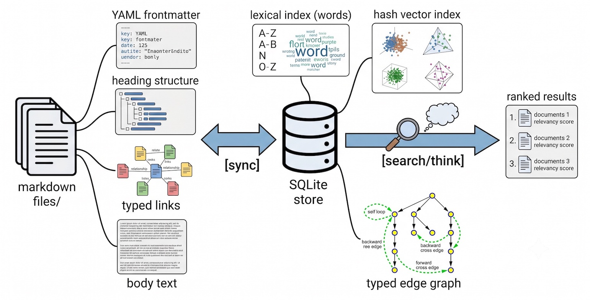

# Evomem

Blazingly fast **Knowledge infrastructure for AI agents**. Because knowledge is power, and power needs knowledge, and knowledge needs to be fast.

Evomem is a CLI tool, server, and embeddable library that turns a directory of markdown files into a queryable "knowledge" inspired by [gbrain](https://github.com/garrytan/gbrain) and [Obsidian](https://obsidian.md/), combining lexical search, hash-based vector embeddings, and typed knowledge graphs with zero LLM dependency at query time. It gives AI agents persistent, structured memory without the cost, latency, or unpredictability of calling an LLM for every retrieval.

It is **blazingly fast**, can complete query in under 45ms for 1,000 pages, full re-sync takes ~1.3 ms per page, and the binary is a compact 8 MB with no runtime dependencies.

The design is minimal by choice. Your knowledge is just markdown files in a git repo — easy to edit, diff, backup, and version. Write your notes, capture thoughts with `evomem capture`, and the system handles indexing, ranking, and graph traversal automatically.

## How it works



- **Disk is the source of truth.** Edit your markdown files, run `evomem sync` to update the database.
- **No LLM required** for retrieval. Everything — intent classification, embedding, ranking — is deterministic.
- **Self-wiring graph.** Typed edges (founded, works_at, advises, invests_in, mentions, custom) are extracted from markdown blockquotes and auto-resolved across pages.
- **EvoRank.** Deterministic scoring: authority prior (in-degree), recency boost, reciprocal-rank fusion of lexical + vector signals.

## Performance

Benchmarks run on Apple M3 Pro (18 GB) against synthetic markdown corpora using the native release binary. Times are **mean across 5 queries** with cold cache (no OS page cache warm-up). All retrieval is deterministic, no LLM calls at query time.

### Query latency vs. knowledge base size

| KB size | DB size | init |  sync | search (conserv.) | search (balanced) | search (tokenmax) | think | graph-query |
| ------: | ------: | ---: | ----: | ----------------: | ----------------: | ----------------: | ----: | ----------: |
|      10 |  312 KB | 19ms |  18ms |               9ms |               8ms |               5ms |   7ms |         3ms |
|      50 |  1.3 MB |  5ms |  38ms |               7ms |               8ms |               6ms |   6ms |         3ms |
|     100 |  2.6 MB |  6ms |  71ms |               9ms |              11ms |               9ms |   8ms |         3ms |
|     500 |   13 MB |  6ms | 559ms |              22ms |              21ms |              22ms |  23ms |         4ms |
|   1,000 |   26 MB |  6ms |  1.3s |              42ms |              40ms |              39ms |  38ms |         3ms |

Key takeaways:

- **Search latency** stays under **45ms** even at 1,000 pages / 26 MB — dominated by hybrid fusion (lexical + vector + graph re-rank).
- **Think latency** (synthesis with gap analysis) is within 1–2 ms of plain search — the overhead is negligible.
- **Graph queries** are near-constant (~3 ms) regardless of corpus size — adjacency lookups are index-only.
- **Sync time** scales linearly, ~1.3 ms per page on this hardware. For a 100-page notebook, the full re-index costs less than 0.1 s.
- The **~5 ms floor** across small corpora is CLI startup overhead (arg parsing, DB open, etc.). In server mode this disappears — queries route through a persistent process.

## Installation

```bash
cargo install evomem
```

Or build from source:

```bash
git clone <repo-url>
cd evomem
make build
```

## Quick start

```bash
# Initialize a evomem in the current directory
evomem init

# Write some markdown files...
echo '# Hello World' > hello.md

# Sync them into the database
evomem sync

# Search
evomem search "hello"

# Capture a quick thought (creates a timestamped file in inbox/)
evomem capture "Interesting idea about neural networks"

# Think — synthesize facts with gap analysis
evomem think "what do I know about rust"

# Traverse the knowledge graph
evomem graph-query some-page --hops 3

# Show page content
evomem page hello
```

## CLI commands

| Command               | Description                                                         |
| --------------------- | ------------------------------------------------------------------- |
| `init`                | Initialize a evomem (creates the database in the evomem directory)  |
| `sync`                | Sync markdown files into the database (disk is the source of truth) |
| `capture <text>`      | Capture a quick thought into `inbox/` and index it immediately      |
| `search <query>`      | Raw hybrid retrieval: ranked results with evidence tags             |
| `think <query>`       | Knowledge synthesis: composed facts with citations + gap analysis   |
| `graph-query <start>` | Traverse typed edges from a page (multi-hop)                        |
| `page <slug>`         | Show a page's metadata and content                                  |
| `stats`               | Knowledge store statistics                                          |
| `serve`               | Run as a standalone REST API server                                 |

### Global flags

| Flag                | Description                                                                             |
| ------------------- | --------------------------------------------------------------------------------------- |
| `--knowledge <dir>` | Knowledge root directory (default: `.`, env: `EVOMEM_ROOT`)                             |
| `--server <url>`    | Run against a remote evomem server instead of the local database (env: `EVOMEM_SERVER`) |
| `--json`            | Emit machine-readable JSON instead of human output                                      |

### Retrieval modes

| Mode                 | Description                     |
| -------------------- | ------------------------------- |
| `conservative`       | Fewer results, higher precision |
| `balanced` (default) | Balanced precision/recall       |
| `tokenmax`           | Maximum recall                  |

## Markdown features

### Frontmatter

```yaml
---
title: My Page
type: person
aliases: [nickname, handle]
tags: [rust, systems]
created: 2026-01-05
updated: 2026-06-20
---
```

All fields are optional and parsed leniently — a stray scalar where a list is expected won't reject the file.

### Typed links

Create typed edges between pages with blockquote syntax:

```markdown
> founded: Acme Corp
> works_at: Acme Corp
> advises: Some Startup
```

Edge types: `founded`, `invested_in`, `works_at`, `advises`, `attended`, `mentions`, or any custom type.

## Server mode

Run as a REST API:

```bash
evomem serve --host 127.0.0.1 --port 7700
```

Then use `--server` from another machine:

```bash
evomem --server http://host:7700 search "query"
```

## Architecture

### Retrieval pipeline

1. **Intent classification** — deterministic: entity, temporal, event, or general
2. **Lexical search** — bucket-sort ranking over word-indexed postings
3. **Vector search** — BLAKE3-based hash embedding (512-dim, deterministic)
4. **Reciprocal-rank fusion** — merges lexical + vector candidates
5. **Graph augmentation** — re-ranks via authority prior (in-degree)
6. **EvoRank scoring** — final rank with evidence tags

### Bucket-sort ranking

Lexical ranking uses bucket-sort: results are sorted not by a single BM25 score, but by a cascade of tie-breaking rules. Each rule acts as a bucket — if two chunks tie on the first rule, the second decides, and so on.

The rules in order:

1. **Word count** — chunks matching more query words win outright.
2. **IDF weight** — among equal word counts, matching rarer (more discriminative) query words wins.
3. **Typo cost** — fewer/cheaper corrections win: exact (0) < stem match (1) < one typo (2) < two typos (4).
4. **Proximity** — matched words closer together win; reversed query-order pairs pay a penalty.
5. **Attribute** — earlier attribute wins (title > heading > body), then earlier word position.
6. **Exactness** — exact word matches beat prefix, stem, or typo-derived matches.

This approach gives deterministic, explainable ranking — every result position is traceable to the rule that decided it.

### Search evidence tags

| Tag                 | Meaning                           |
| ------------------- | --------------------------------- |
| `alias_hit`         | Matched an alias from frontmatter |
| `exact_title_match` | Title matched exactly             |
| `keyword_exact`     | Keyword matched in body text      |
| `high_vector_match` | Cosine similarity > 0.45          |
| `graph_adjacent`    | Adjacent in the knowledge graph   |
| `weak_semantic`     | Weak vector/semantic match        |

## Build

```bash
make build        # native release build
make check        # cargo check
make test         # cargo test
make clippy       # cargo clippy (deny warnings)
make fmt          # cargo fmt --check
make fmt-fix      # cargo fmt

# Cross-compile (requires cargo-zigbuild)
make build-linux-musl # x86_64-unknown-linux-musl (fully static)
make build-linux-gnu  # x86_64-unknown-linux-gnu
make build-darwin-arm # aarch64-apple-darwin
make build-darwin-x64 # x86_64-apple-darwin

# Distribution packages (all targets, versioned .zip)
make dist
```

## License

MIT
